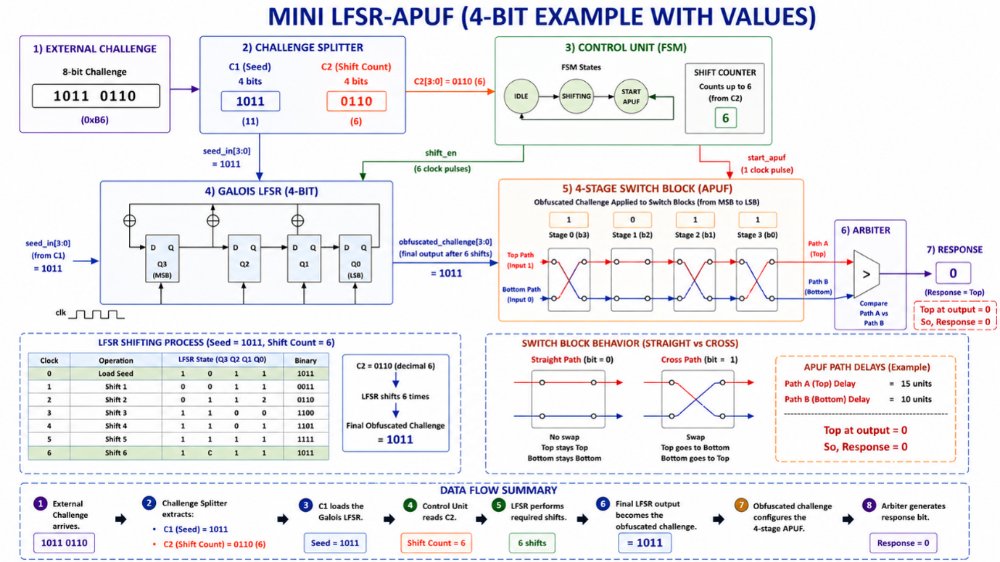
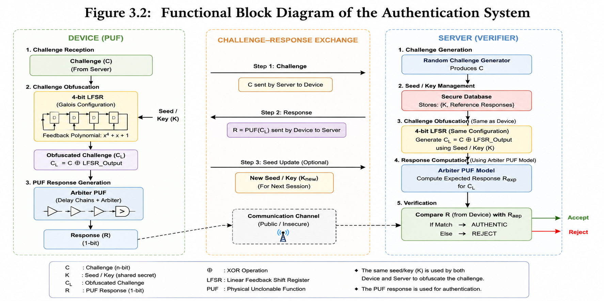
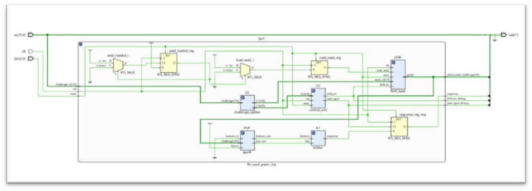

# FPGA-Based Lightweight Authentication using a 4-bit LFSR-Assisted Arbiter PUF

## Overview

This repository presents the design, FPGA implementation, and security evaluation of a lightweight authentication system based on a **4-bit LFSR-Assisted Arbiter Physical Unclonable Function (LFSR-APUF)**.

The architecture is inspired by the IEEE paper:

> *Y. Wang, X. Mei, Z. Chang, W. Fan, B. Guo, and Z. Quan, "A Lightweight Authentication Protocol against Modeling Attacks Based on a Novel LFSR-APUF," IEEE INTERNET OF THINGS JOURNAL, VOL. 18, NO. 9, SEPTEMBER 2020*

The complete system was implemented using **Verilog HDL**, synthesized on a **Xilinx Spartan-7 XC7S50 FPGA** using **Vivado 2025.1**, and evaluated through a Python-based framework supporting authentication, randomness analysis, and machine learning attack evaluation.
---

## Features

- 4-bit LFSR-assisted Arbiter PUF
- FPGA implementation using Verilog HDL
- Challenge obfuscation using LFSR
- Lightweight mutual authentication protocol
- Replay attack prevention
- Fake device detection
- Challenge-Response Pair (CRP) generation
- Statistical randomness evaluation
- Machine learning attack evaluation
- FPGA timing, power, and resource analysis

---

## Project Workflow

Challenge
↓
4-bit LFSR
↓
Challenge Obfuscation
↓
Arbiter PUF
↓
Response Generation
↓
Challenge-Response Pair Database
↓
Mutual Authentication
↓
Security Evaluation

---

## Hardware Platform

- FPGA Board: Boolean Board
- FPGA Device: Xilinx Spartan-7 XC7S50
- Design Tool: Vivado 2025.1

---

## Repository Structure

```text
HDL/
Simulation/
Constraints/
Python/
Results/
Images/
Report/
README.md
```

---

## Architecture



---

## Authentication Flow



---


## RTL Architecture



---

## FPGA Implementation Results

| Parameter | Result |
|-----------|---------|
| FPGA | Spartan-7 XC7S50 |
| LUTs | 28 |
| Registers | 16 |
| Maximum Frequency | 163.3 MHz |
| Total On-Chip Power | 86 mW |

---

## Security Evaluation

The authentication framework supports:

- Device Registration
- Mutual Authentication
- Replay Attack Detection
- Fake Device Detection

Additionally,

- Entropy Analysis
- Bias Analysis
- Runs Test
- Machine Learning Modeling Attack Evaluation

were performed using Python.

---

## Machine Learning Evaluation

Models evaluated:

- Logistic Regression
- Support Vector Machine
- Random Forest

Comparison plots are available in:

```

Results\Modeling_Attack\Modeling_attack_Results

```

---

## Randomness Evaluation

Randomness analysis includes:

- Entropy
- Bias
- Runs Test

Results are available in

```

Results\Randomness\Randomness_Results

```

---

## How to Run

### Vivado

1. Open the Vivado Project
2. Run Synthesis
3. Run Implementation
4. Generate Bitstream
5. Program FPGA

### Python

Run

```bash
python registration.py

python authentication.py

python protocol_demo.py
```

---

## Reference

Y. Wang, X. Mei, Z. Chang, W. Fan, B. Guo, and Z. Quan, "A Lightweight Authentication Protocol against Modeling Attacks Based on a Novel LFSR-APUF," IEEE INTERNET OF THINGS JOURNAL, VOL. 18, NO. 9, SEPTEMBER 2020 

---

## Author

Aditya Amitabh Yadav

Department of Electrical and Electronics Engineering

ABV-Indian Institute of Information Technology and Management, Gwalior
